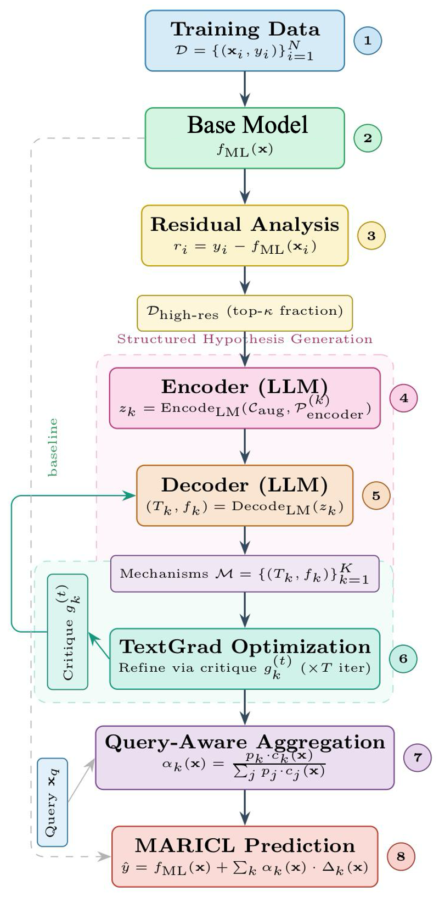
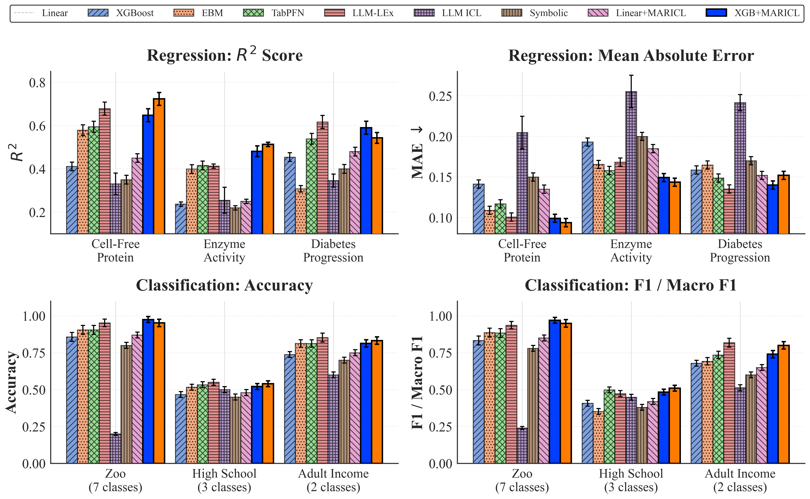

# MARICL — Multi-Agent Residual In-Context Learning

**Paper:** [From Residuals to Reasons: LLM-Guided Mechanism Inference from Tabular Data](https://arxiv.org/abs/2605.18742)  
**arXiv:** `2605.18742` · **Submitted to NeurIPS 2026**

---

## Abstract

> A persistent challenge in machine learning for scientific applications is jointly achieving prediction and understanding. Statistical models excel on structured data but operate as black boxes, while existing interpretability methods are largely *inspective*: they answer "which features matter?" but do not articulate how features interact or refine explanations iteratively alongside human understanding. End-to-end LLM agents must search the full output domain; we instead target the smaller, structured space of base-model residuals. We introduce **Multi-Agent Residual In-Context Learning (MARICL)**, an agentic framework in which LLM agents analyze where a base model fails, hypothesize missing structure from high-residual examples provided in context, and produce explicit correction terms refined through multi-turn textual gradient optimization. Across nine benchmarks spanning scientific, biomedical, socioeconomic, and synthetic settings, MARICL improves consistently over its base model on all datasets. A cross-plate transfer experiment on the Cell-Free Protein dataset further validates that the inferred formulas capture real structure rather than batch-specific noise: correction formulas frozen from one plate and applied directly to separate plates improve predictions in over 92% of cases within the same reagent cohort, but fail systematically on plates from a different reagent regime — evidence of mechanistic generalization rather than overfitting.

---

## Overview



**(1–2)** A base ML model produces initial predictions. **(3)** Residual analysis selects high-error examples $\mathcal{D}_{\text{high-res}}$. **(4–5)** An LLM encoder produces structured hypotheses $z_k$; a decoder converts each into a natural-language explanation $T_k$ and an executable correction formula $f_k$. **(6)** Textual gradient optimization refines corrections through multi-turn critique feedback $g_k^{(t)}$. **(7–8)** Query-aware aggregation combines the base prediction with weighted corrections $\alpha_k(\mathbf{x})$.

**Prediction rule (regression):**

$$\hat{y}_{\text{MARICL}}(\mathbf{x}) = f_{\text{ML}}(\mathbf{x}) + \sum_{k=1}^{K} \alpha_k(\mathbf{x})\, f_k(\mathbf{x})$$

At inference time, only the frozen formulas run — **zero LLM calls**.

---

## Results



Performance across regression ($R^2$, MAE) and classification (accuracy, macro-F1) benchmarks (±1 std, 5 seeds). Selected highlights:

| Benchmark | Base | MARICL | $\Delta$ |
|---|---|---|---|
| Cell-Free Protein (Linear base) | $R^2 = 0.35$ | $R^2 = 0.59$ | **+0.236** |
| Cell-Free Protein (XGBoost base) | — | — | **+0.144** |
| Adult Income (XGBoost base) | F1 = 0.692 | F1 = 0.800 | **+0.108 (+15.6%)** |

MARICL outperforms all base models on every real benchmark, with gains strongest where the base model is weakest.

---

## Repository contents

```
.
├── maricl_core.py                        # MARICL framework (sandbox, models, prompts, pipeline)
├── maricl_demo_v1.ipynb                  # Experiments notebook (imports maricl_core)
└── MA_RICL_Discovery_V2/
    └── Figures/
        ├── figure1_maricl_schematic_v2.png
        └── results_figure.png
```

`maricl_core.py` contains everything that is not experiment-specific: the `ast`-sandboxed formula executor, Pydantic structured-output models (`Hypothesis`, `Correction`, `Critique`), encoder/decoder/critique prompts and functions, `CorrectionState`, and the `MARICL` class. The notebook imports the module and calls `maricl_core.configure_llms(llm, llm_creative)` once after initializing the LLM clients.

---

## Quickstart

### 1. Install dependencies

```bash
pip install langchain langchain-openai openai pydantic numpy scikit-learn matplotlib python-dotenv
```

### 2. Set your API key

Create a `.env` file in the project root:

```
OPENAI_API_KEY=sk-...
```

The notebook also accepts `API_KEY` as an alias. **Do not commit this file.**

### 3. Run the notebook

Open [`maricl_demo_v1.ipynb`](maricl_demo_v1.ipynb) and execute cells sequentially.

Optional environment overrides:

| Variable | Default | Description |
|---|---|---|
| `MAICL_MODEL_NAME` | `gpt-5.4-mini` | Model passed to LangChain/OpenAI |
| `OPENAI_REASONING_EFFORT` | `low` | Reasoning effort for GPT-5 family (`none` to disable) |

> Expect OpenAI API usage charges. Results vary slightly due to nonzero temperature.

---

## Synthetic demo scenarios

The notebook contains two self-contained experiments that require no external data.

### Experiment 1 — Synthetic regression

A linear base model is fit on a 4-feature dataset whose true generating process contains structure it cannot capture:

$$y = 0.5\,x_1 - 0.3\,x_2 + 0.2\,x_3 + 1.8\cdot\sigma(2\,x_1 x_2) + 0.4\,x_3^2 + \varepsilon, \quad \varepsilon \sim \mathcal{N}(0, 0.1)$$

The linear model fits only the first three linear terms; the **sigmoid interaction** ($x_1 \times x_2$) and the **quadratic term** ($x_3^2$) become residual signal. MARICL's encoder agents hypothesize these missing structures from the high-residual examples, the decoder compiles them into executable formulas, and textual gradient refinement iterates toward the true form.

**Setup:** 300 samples · 60/20/20 train/val/test split · `K=2` agents · `T=8` refinement steps

### Experiment 2 — Synthetic 3-class classification

A logistic regression base model is fit on a 4-feature dataset with a nonlinear decision boundary:

$$\text{class} = \begin{cases} 0 & x_1 x_2 < -0.5 \\ 2 & x_1 x_2 > +0.5 \\ 1 & \text{otherwise} \end{cases} \quad \text{(with } 0.5\,(x_3^2 - 1) \text{ perturbation and 2\% label noise)}$$

A logistic model captures only marginal effects and misses the interaction boundary. MARICL's correction agents discover the $x_1 \times x_2$ interaction and apply class-conditional correction probabilities.

**Setup:** 500 samples · 60/20/20 split · `K=3` agents · `T=8` refinement steps · `beta=0.3` · `kappa=0.4`

---

## How it works

```
Base model → high-residual examples → Encoder agents (hypothesize) →
Decoder agents (compile to formulas) → Critique & refine (T rounds) →
Query-aware aggregation → Final prediction
```

Key design choices:
- **Residual targeting** — LLMs explain *what the base model misses*, not the full label.
- **Executable corrections** — Each $f_k$ is a sandboxed Python expression validated by `ast` at fit time. Only arithmetic runs at inference.
- **Textual gradients** — Critique feedback ($g_k^{(t)}$) drives iterative refinement of both the explanation $T_k$ and formula $f_k$.
- **Query-aware gating** — $\alpha_k(\mathbf{x})$ down-weights a correction when the query lies far from the residual cluster it was inferred from.

---

## Citation

```bibtex
@misc{rezaei2026maricl,
  title     = {From Residuals to Reasons: {LLM}-Guided Mechanism Inference from Tabular Data},
  author    = {Rezaei, Mohammad R. and Krishnan, Rahul G.},
  year      = {2026},
  eprint    = {2605.18742},
  archivePrefix = {arXiv},
  primaryClass  = {stat.ML},
  url       = {https://arxiv.org/abs/2605.18742},
  note      = {Submitted to NeurIPS 2026},
}
```
